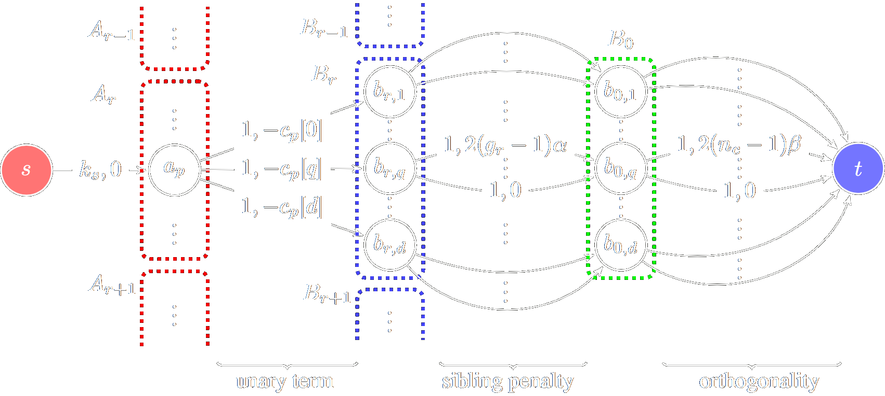

<style>
td, th{
    border: none!important;
}
</style>

## README.md

|   |   |
|---|---|
|  |I'm a fifth-year Ph.D. student in Computer Science and Engineering at Seoul National University, advised by [Hyun Oh Song](https://mllab.snu.ac.kr/hyunoh). I previously graduated from Seoul National University in 2018 with a B.S. in electical and computer engineering. My research interests are combinatorial optimization and machine learning.  Also, I'm interested in Blockchain and cryptocurrency.|


# /News
```
I'm serving as a technical research personnel in Seoul National University.
```

# /Publications

|   |   |
|---|---|
|  |Optimal channel selection with discrete QCQP<br>**Yeonwoo Jeong**, Deokjae Lee, Gaon An, Changyong Son, Hyun Oh Song<br>_International Conference on Artificial Intelligence and Statistics (AISTATS), 2022_|
|  |End-to-End Efficient Representation Learning via Cascading Combinatorial Optimization<br> **Yeonwoo Jeong**, Yoonsung Kim, Hyun Oh Song<br>_IEEE Computer Vision and Pattern Recognition (CVPR), 2019_|
| |Learning Discrete and Continuous Factors of Data via Alternating Disentanglement<br>**Yeonwoo Jeong**, Hyun Oh Song<br>_International Conference on Machine Learning (ICML), 2019_|
| |EMI: Exploration with Mutual Information<br>Hyoungseok Kim*, Jaekyeom Kim*, **Yeonwoo Jeong**, Sergey Levine, Hyun Oh Song<br>_International Conference on Machine Learning (ICML), 2019_<br> Long talk (159/3424=4.6%)|
| |Efficient end-to-end learning for quantizable representations<br>**Yeonwoo Jeong**, Hyun Oh Song<br>_International Conference on Machine Learning (ICML), 2018_<br>Long talk (213/2473=8.6%)|

# /Honors and Awards

> 2021 Youlchon AI Star Felloship
>
> 2020 Qualcomm innovation Fellowship (South Korea) winner
>
> 2019 NRF Global PH.D. Fellowship Porgram 
>
> 2018 KFAS cOmputer Science Graudate Student Scholarship

# /Coding skills
> Rust 
>
> Java 
>
> C++ 
>
> Python 


